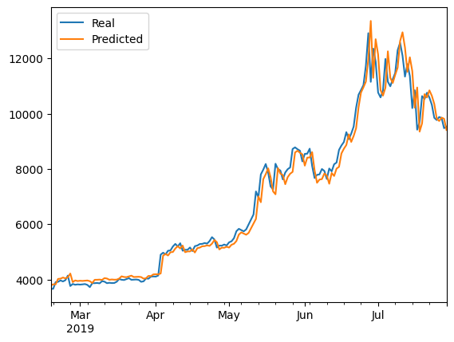
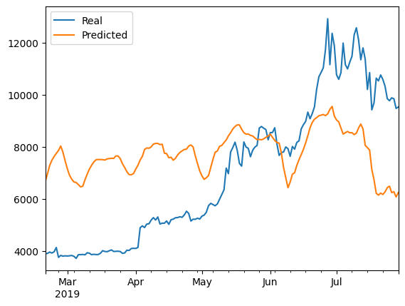

# Deep-Learning

### Description
Used an LSTM deep learning model in two different ways to see which methods are more accurate predictors of Bitcoin closing prices

## Process:
I started with the model trained on closing prices, using a 10 day window by default. I experimented with different neural net architecture but ended up getting the lowest loss rate with one layer, 25 neurons, a dropout rate of 40%, 29 training epochs, and a batch_size of 5.

I then replicated that architecture for the model trained on the Crypto Fear and Greed Index. The results were much worse. I didn't adjust the previously mentioned model architecture since the goal is to compare the two LSTM models with identical architecture, so I experimented by adjusting the window between 1 and 10 days. There was very little difference on the loss rate but I found a 7 day window to be slightly lower.

Finally I went back to the model trained on closing prices to adjust the window and noticed a significant improvement over the already adequate results using a 1 day window.

### Questions and Answers
* Which model has a lower loss?
**The closing price model had the lower evaluation loss with 0.0027, compared to the FNG model with 0.0986. It was lower regardless of the window settings.**
* Which model tracks the actual values better over time?
**The closing price model does, pictured below:**  
  
**This is the Fear and Greed model:**  
  
* Which window size works best for the model?  
**1 day for the closing price model, 7 days for the fear and greed model**